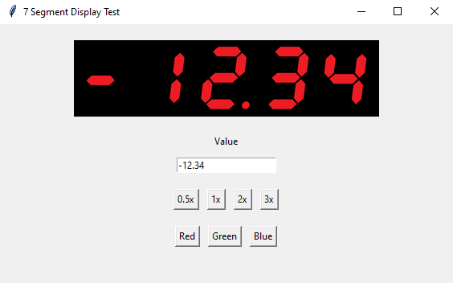

# Seven Segment Display Widget for Tkinter

<p align="center">
  
</p>

A reusable seven-segment display widget for Python Tkinter applications.

This widget supports:

* Digits `0-9`
* Hex characters `A-F`
* Special characters:

  * Space (` `)
  * Minus (`-`)
  * Equals (`=`)
  * Underscore (`_`)
* Decimal points
* Multiple color themes
* Runtime theme switching
* Runtime scaling
* `StringVar` support
* Hexadecimal display helper

Designed for instrumentation panels, test equipment, HMIs, embedded tools, and other applications requiring a classic seven-segment display appearance.

---

## Features

### Supported Characters

```text
0 1 2 3
4 5 6 7
8 9 A B
C D E F
  - = _
```

### Theme Support

Themes are loaded from sprite sheets.

```python
display.configure(theme="Green")
```

### Scaling

Displays can be resized at runtime.

```python
display.configure(scale=2.0)
```

### StringVar Support

Automatically update the display from a Tkinter variable.

```python
value_var = tk.StringVar()

display = SevenSegmentDisplay(
    root,
    textvariable=value_var
)

value_var.set("12.34")
```

### Hex Display

```python
display.set_hex(0xBEEF)
```

Result:

```text
BEEF
```

---

## Installation

Install Pillow:

```bash
pip install pillow
```

Clone the repository:

```bash
git clone https://github.com/douggmill/seven-segment-display.git
cd seven-segment-display
```

---

## Project Structure

```text
project/
│
├── main.py
├── seven_segment.py
├── README.md
│
├── screenshots/
│   └── demo.png
│
└── sprites/
    ├── Red_Seven_segment_display.png
    ├── Red_Seven_segment_display_decimal.png
    ├── Green_Seven_segment_display.png
    ├── Green_Seven_segment_display_decimal.png
    ├── Blue_Seven_segment_display.png
    ├── Blue_Seven_segment_display_decimal.png
```

---

## Sprite Sheet Layout

Each sprite sheet uses a 4×5 layout.

```text
0  1  2  3
4  5  6  7
8  9  A  B
C  D  E  F
   -  =  _
```

The decimal sprite sheet contains the same layout with decimal points enabled.

---

## Basic Usage

```python
import tkinter as tk

from seven_segment import SevenSegmentDisplay

root = tk.Tk()

display = SevenSegmentDisplay(
    root,
    digits=4,
    theme="Red"
)

display.pack()

display.set("12.34")

root.mainloop()
```

---

## Constructor Parameters

### digits

Number of display positions.

```python
display = SevenSegmentDisplay(
    root,
    digits=4
)
```

### theme

Select sprite sheet color theme.

```python
display = SevenSegmentDisplay(
    root,
    theme="Green"
)
```

### scale

Scale display size.

```python
display = SevenSegmentDisplay(
    root,
    scale=2.0
)
```

### value

Initial value.

```python
display = SevenSegmentDisplay(
    root,
    value="1234"
)
```

### textvariable

Bind to a Tkinter StringVar.

```python
value_var = tk.StringVar()

display = SevenSegmentDisplay(
    root,
    textvariable=value_var
)
```

---

## Methods

### set()

Display a value.

```python
display.set("1234")
display.set("12.34")
display.set("-123")
display.set("BEEF")
```

### get()

Return the current value.

```python
value = display.get()
```

### set_hex()

Display an integer as hexadecimal.

```python
display.set_hex(48879)
```

Result:

```text
BEEF
```

### configure()

Change theme or scale at runtime.

```python
display.configure(theme="Blue")
display.configure(scale=3.0)
```

---

## Examples

### Numeric Display

```python
display.set("1234")
```

### Decimal Display

```python
display.set("12.34")
```

### Negative Values

```python
display.set("-12")
display.set("-1.2")
```

### Hexadecimal Values

```python
display.set("DEAD")
display.set("CAFE")
display.set("BEEF")
```

### Special Characters

```python
display.set("----")
display.set("====")
display.set("____")
```

### StringVar Example

```python
import tkinter as tk

from seven_segment import SevenSegmentDisplay

root = tk.Tk()

value_var = tk.StringVar()

display = SevenSegmentDisplay(
    root,
    digits=4,
    theme="Red",
    textvariable=value_var
)

display.pack()

entry = tk.Entry(
    root,
    textvariable=value_var
)

entry.pack()

value_var.set("12.34")

root.mainloop()
```

---

## Requirements

* Python 3.12+
* Pillow

```bash
pip install pillow
```

---

## Intended Uses

* Test equipment
* Instrumentation panels
* Embedded system tools
* Production fixtures
* Diagnostic software
* HMI interfaces
* Retro-style displays

---

## License

MIT License

Copyright (c) 2025 Douglas Gammill
